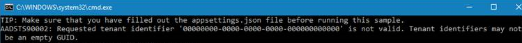

# Azure Media Services v3 tutorials

## NOTE

You can find the latest and most extensive .NET samples in the [Azure Media Services v3](https://github.com/Azure-Samples/media-services-v3-dotnet) repository.

This repo contains a base set of tutorials for the documentation only. Be sure to check out the more detailed set of samples in <https://github.com/Azure-Samples/media-services-v3-dotnet>.

We are attempting to consolidate more of our .NET samples into that single repository going forward.

## Overview

The projects in this repository were created using Visual Studio 2019. They target .NET 5.0. These projects support the Azure Media Services v3 articles:

|Project name|Article|
|---|---|
|UploadEncodeAndStreamFiles/UploadEncodeAndStreamFiles.csproj|[Tutorial: Upload, encode, download, and stream videos](https://docs.microsoft.com/azure/media-services/latest/stream-files-tutorial-with-api)|
|AnalyzeVideos/AnalyzeVideos.csproj|[Tutorial: Analyze videos with Media Services](https://docs.microsoft.com/azure/media-services/latest/analyze-videos-tutorial)|
|EncryptWithAES/EncryptWithAES.csproj|[Use AES-128 dynamic encryption and the key delivery service](https://docs.microsoft.com/azure/media-services/latest/drm-protect-with-aes128-tutorial)|
|EncryptWithDRM/EncryptWithDRM.csproj|[Use DRM dynamic encryption and license delivery service](https://docs.microsoft.com/azure/media-services/latest/protect-with-drm)|

## Prerequisites

To run samples in this repository, you need:

* Visual Studio 2019 or Visual Studio Code.
* [.NET 5.0 SDK](https://dotnet.microsoft.com/download)
* An Azure Media Services account. See the steps described in [Create a Media Services account](https://docs.microsoft.com/azure/media-services/latest/create-account-cli-quickstart).

## NuGet packages

The following NuGet packages were added to the project:

|Package|Description|
|---|---|
|Microsoft.Azure.Management.Media|Azure Media Services SDK.  To make sure you are using the latest Azure Media Services package, check [Microsoft.Azure.Management.Media](https://www.nuget.org/packages/Microsoft.Azure.Management.Media).|
|Microsoft.Identity.Client|MSAL authentication library for Azure SDK for NET|
|Microsoft.Extensions.Configuration.EnvironmentVariables|Read configuration values from environment variables and local JSON files|
|Microsoft.Extensions.Configuration.Json|Read configuration values from environment variables and local JSON files
|Microsoft.Azure.Storage.Blob|Storage SDK|

## Common Issues and Troubleshooting

* Assets in Media Services have naming conventions that must be adhered to in order to avoid errors. For example the client.Assets.CreateOrUpdateAsync can fail with message "The resource type is invalid" if the name does not match the [naming conventions listed in this article](https://docs.microsoft.com/en-us/azure/media-services/latest/media-services-apis-overview#naming-conventions)

## To build and run each project in the solution

* Clean and rebuild the solution.
* Set the desired project as the **Set as Startup project**.
* Add appropriate values to the appsettings.json configuration file. For more information, see [Access APIs](https://docs.microsoft.com/azure/media-services/latest/access-api-cli-how-to). As an alternative, you can create a .env file derived from the [sample.env template](/AMSV3Tutorials/sample.env) and store this file in the [AMSV3Tutorials folder](/AMSV3Tutorials).

If you get the following error message, when first attempting to run a project, close VS and reopen it. Then, rebuild the solution.  

